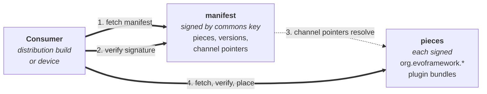

# evo-device-audio-artefacts

> The release plane for [evo-device-audio](https://github.com/foonerd/evo-device-audio). Brand-neutral audio plugin commons artefacts, signed by the evo project, fetched by any audio distribution.

Manifest in. Signed bytes out. Consumers pick the channel.

This repository is the device-facing (and distribution-facing) surface of the audio-domain plugin commons. Editing source code in [evo-device-audio](https://github.com/foonerd/evo-device-audio) does not touch these assets. What lands here is exactly what an audio distribution (or a device tracking commons directly) fetches and verifies.

## What lives here

Empty today. The release-plane contract (artefact-manifest schema, channel-pointer signing format, verification protocol) is being authored in evo-core; the publish pipeline waits on its release. First content arrives when both: (a) the contract is documented in evo-core, (b) [evo-device-audio](https://github.com/foonerd/evo-device-audio)'s `promote.yml` workflow is wired against it.

## Channels

Three named tracks of release readiness: `dev`, `test`, `prod`. Same shape as every other release plane in the evo ecosystem.

-   **A channel is a pointer, not a bucket.** A version of a piece is built once, signed once, stored once. Promotion from `dev` to `test` is a manifest edit - the channel's pointer now names that version. The bytes do not change; the signature does not change. Bit-identical artefacts across every channel they appear on.
-   **Selection is per-piece, per-consumer.** A consumer's channel map says, for each piece: which channel's pointer do you track? A developer iterating on one plugin can track `dev` for that plugin and `prod` for everything else.
-   **Rollback is a pointer move.** Re-promote a prior version to the same channel. No rebuild. No re-signing.

## Consuming artefacts

Two consumer profiles:

-   **Audio distributions** (`evo-device-<vendor>` repositories) bundle the commons trust root by default and admit `org.evoframework.*` plugins via their catalogue. The distribution's build process or its own release plane references commons pieces by version and channel.
-   **Devices** that bundle the commons trust root may fetch commons pieces directly from this repository at runtime, alongside the vendor's own pieces, when the device-side fetch tooling is wired to pull from multiple release planes.

Either way: the consumer verifies the manifest signature against the commons public key (`keys/commons-plugin-signing-public.pem` in the source repo), then verifies each piece's signature before placing it.

## Publishing artefacts

Two workflows in [evo-device-audio](https://github.com/foonerd/evo-device-audio) write to this repository (placeholders today; activate when the release-plane contract lands in evo-core):

-   **continuous-dev** - on code commits to the source repo, automatically builds, signs, and publishes to the `dev` channel.
-   **promote** - on manual dispatch, edits channel pointers in the manifest and re-signs the manifest. No rebuild.

The `manual-build` workflow does not publish to this repository; it builds and uploads to GitHub Actions per-run artefact storage for inspection only.

## Signing and trust

The evo project signs every artefact under this namespace with the commons signing key. The private key lives only in the GitHub Actions repository secret `PLUGIN_SIGNING_KEY_PEM` on the source repository. The public half is committed in the source repository at [`keys/commons-plugin-signing-public.pem`](https://github.com/foonerd/evo-device-audio/blob/main/keys/commons-plugin-signing-public.pem) with sidecar metadata at [`keys/commons-plugin-signing-public.meta.toml`](https://github.com/foonerd/evo-device-audio/blob/main/keys/commons-plugin-signing-public.meta.toml).

Public key fingerprint (SHA256 of the DER-encoded SubjectPublicKeyInfo):
`9cd7d7381ee7c2b3bfa490b39077afdc925192299dda661ef94dddba71e574da`

Distributions that admit `org.evoframework.*` plugins bundle this trust root by default. Operators retain final say per the framework's operator-sovereignty position.

## Status

Empty. Populated when (a) the evo-core release-plane contract lands, and (b) [evo-device-audio](https://github.com/foonerd/evo-device-audio)'s publish workflows wire against it.

## Related

-   [foonerd/evo-device-audio](https://github.com/foonerd/evo-device-audio) - the source repository this release plane serves.
-   [foonerd/evo-core](https://github.com/foonerd/evo-core) - the framework.
-   [foonerd/evo-device-volumio-artefacts](https://github.com/foonerd/evo-device-volumio-artefacts) - the first audio distribution's release plane; consumes commons pieces.

## License

Apache 2.0. See [LICENSE](LICENSE).
